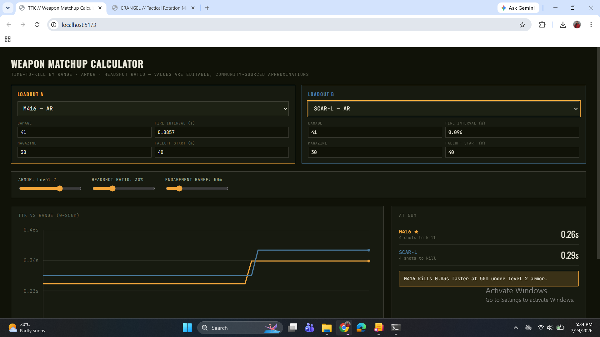

<div align="center">

# PUBG Weapon Matchup Calculator

<svg xmlns="http://www.w3.org/2000/svg" viewBox="0 0 1200 120" width="100%" height="120">
  <defs>
    <linearGradient id="bg" x1="0%" y1="0%" x2="100%" y2="100%">
      <stop offset="0%" stop-color="#0f1419" />
      <stop offset="50%" stop-color="#1a232a" />
      <stop offset="100%" stop-color="#0f1419" />
    </linearGradient>
    <linearGradient id="accent" x1="0%" y1="0%" x2="100%" y2="0%">
      <stop offset="0%" stop-color="#d97706" />
      <stop offset="50%" stop-color="#f59e0b" />
      <stop offset="100%" stop-color="#d97706" />
    </linearGradient>
    <linearGradient id="grid" x1="0" y1="0" x2="20" y2="20" gradientUnits="userSpaceOnUse">
      <path d="M 20 0 L 0 0 0 20" fill="none" stroke="#ffffff" stroke-width="0.5" stroke-opacity="0.05" />
    </linearGradient>
  </defs>

  <rect width="100%" height="100%" fill="url(#bg)" rx="8"/>
  <rect width="100%" height="100%" fill="url(#grid)" rx="8"/>
  <rect x="0" y="116" width="100%" height="4" fill="url(#accent)" />

  <g transform="translate(40, 65)">
    <circle cx="0" cy="-5" r="18" fill="none" stroke="#f59e0b" stroke-width="1.5" stroke-dasharray="4 2">
      <animateTransform attributeName="transform" type="rotate" from="0" to="360" dur="12s" repeatCount="indefinite" />
    </circle>
    <circle cx="0" cy="-5" r="6" fill="#f59e0b" />
    <line x1="-25" y1="-5" x2="25" y2="-5" stroke="#f59e0b" stroke-width="1" stroke-opacity="0.5" />
    <line x1="0" y1="-30" x2="0" y2="20" stroke="#f59e0b" stroke-width="1" stroke-opacity="0.5" />
  </g>

  <text x="80" y="52" fill="#ffffff" font-family="-apple-system, BlinkMacSystemFont, 'Segoe UI', Roboto, Helvetica, Arial, sans-serif" font-weight="800" font-size="26" letter-spacing="2">PUBG TTK CALCULATOR</text>
  <text x="80" y="76" fill="#94a3b8" font-family="-apple-system, BlinkMacSystemFont, 'Segoe UI', Roboto, Helvetica, Arial, sans-serif" font-weight="400" font-size="13" letter-spacing="1">REAL-TIME BALLISTICS &amp; TIME-TO-KILL MATCHUP ENGINE</text>

  <g transform="translate(1020, 48)">
    <rect x="-10" y="-18" width="150" height="36" rx="18" fill="#d97706" fill-opacity="0.15" stroke="#d97706" stroke-width="1"/>
    <circle cx="6" cy="0" r="4" fill="#10b981">
      <animate attributeName="opacity" values="1;0.2;1" dur="2s" repeatCount="indefinite" />
    </circle>
    <text x="18" y="4" fill="#f59e0b" font-family="monospace" font-weight="700" font-size="11" letter-spacing="1">SYSTEM READY</text>
  </g>
</svg>

<br/>

[](https://react.dev/)
[](https://vitejs.dev/)
[](LICENSE)
[](#technical-overview--utility)

</div>

<br/>

Answers the foundational PUBG combat question: **which weapon yields a lower time-to-kill at a specific engagement range, armor tier, and shot distribution?** Select two loadouts, adjust distance, armor levels, and headshot ratios, and analyze a real-time TTK curve rather than static spreadsheet data.

---

## Media Preview



*Figure 1: Side-by-side weapon loadout comparison with dynamic TTK curve and real-time range inspection.*

[https://github.com/user-attachments/assets/ttk-comparison-demo.mp4](https://github.com/Nihara-D/pubg-ttk-calculator/raw/main/pubg-ttk/assets/ttk-comparison-demo.mp4)

*Video 1: Demonstration of dynamic loadout selection, parameter adjustments, and live graph updates.*

---

## Technical Overview & Utility

PUBG Corporation does not release official mathematical definitions for weapon damage functions. Available community datasets vary and frequently become outdated following patch updates. 

This application resolves static data limitations through the following engineering choices:

* **Pure Ballistics Calculation Engine:** Computes real-time damage falloff step functions and TTK curves dynamically without hardcoded result matrices.
* **In-UI Parameter Overrides:** Every core variable (base damage, fire interval, magazine capacity, and damage falloff start) is editable within the interface, enabling real-time recalibration against patch notes without source code modifications.
* **Zero-Dependency SVG Rendering Canvas:** Implements custom SVG vector paths for plotting linear step curves, avoiding external charting library overhead.

---

## Core Features

* **Dual Loadout Comparison:** Concurrent analysis across 11 default weapon profiles (AR, SMG, DMR, Sniper rifle categories).
* **Dynamic Range Mapping:** Real-time TTK vs. Range plot across a 0–250m vector space.
* **Environmental & Combat Modifiers:** Continuous sliders for armor tier selection (Tiers 0–3) and headshot probability ratios (0%–100%).
* **Inline Variable Overrides:** Directly mutable fields for base damage, fire interval, magazine size, and falloff onset distance.
* **Discrete Engagement Metrics:** Calculates exact shots-to-kill counts, absolute TTK values, and delta differentials at the target crosshair range.

---

## Mathematical & Ballistic Model

The system calculates Time-To-Kill through a discrete multi-stage ballistics model accounting for first-shot instantaneous firing, armor mitigation, distance attenuation, and headshot probability weighting.

### 1. Armor Damage Reduction Matrix

Target health pool is defined as a static vector:

$$H_{total} = 100$$

Damage mitigation factors applied per armor tier ($A_{tier}$):

| Armor Tier ($A_{tier}$) | Body Mitigation Multiplier ($\mu_{body}$) | Head Mitigation Multiplier ($\mu_{head}$) |
| :--- | :--- | :--- |
| Tier 0 (None) | $1.00$ | $1.00$ |
| Tier 1 | $0.70$ (30% reduction) | $0.70$ (30% reduction) |
| Tier 2 | $0.60$ (40% reduction) | $0.60$ (40% reduction) |
| Tier 3 | $0.45$ (55% reduction) | $0.45$ (55% reduction) |

### 2. Distance Damage Falloff Function

Damage attenuation over range ($r$) in meters is calculated using piecewise linear interpolation between the falloff start distance ($r_{start}$) and terminal falloff distance ($r_{end}$):

$$f_{falloff}(r) = \begin{cases} 1.0 & \text{if } r \le r_{start} \\ 1.0 - \left(\frac{r - r_{start}}{r_{end} - r_{start}}\right) \times (1.0 - \text{floor}) & \text{if } r_{start} < r < r_{end} \\ \text{floor} & \text{if } r \ge r_{end} \end{cases}$$

*Where $\text{floor} = 0.80$ (default minimum falloff floor) and $r_{end} = r_{start} + 150\text{m}$.*

### 3. Effective Damage Per Shot Calculation

Effective damage accounts for weapon category headshot multipliers ($\beta_{head}$), hit distribution probability ($P_{head}$), armor mitigation ($\mu$), and distance falloff ($f_{falloff}(r)$):

$$D_{body}(r) = D_{base} \times \mu_{body} \times f_{falloff}(r)$$

$$D_{head}(r) = D_{base} \times \beta_{head} \times \mu_{head} \times f_{falloff}(r)$$

$$\bar{D}_{effective}(r) = \left( D_{body}(r) \times (1 - P_{head}) \right) + \left( D_{head}(r) \times P_{head} \right)$$

*Note: Default weapon class headshot multipliers ($\beta_{head}$): Sniper/DMR = $2.35$, AR = $2.35$, SMG = $1.80$.*

### 4. Shots To Kill (STK) & Time-To-Kill (TTK)

Because weapon damage is discrete, the number of required hits ($\text{STK}$) is rounded up to the next integer using the ceiling function:

$$\text{STK}(r) = \left\lceil \frac{H_{total}}{\bar{D}_{effective}(r)} \right\rceil$$

Since the first round is fired instantly at $t = 0$, the elapsed time delay between shots depends on the fire interval ($\Delta t_{fire}$):

$$\text{TTK}(r) = (\text{STK}(r) - 1) \times \Delta t_{fire}$$

---

## Known Limitations & Edge Cases

* **Calculated Average vs. Stochastic Hits:** The engine uses an expected value weighting ($\bar{D}_{effective}$) for headshot distribution ratios. In real gameplay, individual bullet impacts are discrete binary outcomes (100% headshot or 0% headshot) rather than fractional averages per bullet.
* **Limb Hitbox Modifiers:** Current calculations assume chest/body hit distribution as the base target area and do not model individual limb (hand/forearm/leg) damage reduction multipliers.
* **Durability Depletion:** The model assumes constant armor protection factors ($\mu$) across all hits and does not simulate vest/helmet durability degradation per hit prior to fatal injury.
* **Recoil & Accuracy Multipliers:** Bullet velocity, bullet drop over long ranges ($>200\text{m}$), and recoil recovery times are excluded from the TTK calculation (assumes 100% on-target accuracy at maximum rate of fire).

---

## References & Data Sources

The mathematical formulations and baseline weapon metrics implemented in this engine are derived from empirical community testing and game file data verification:

1. **PUBG Official Wiki Datasets:** Base hit damage values, fire rates, initial bullet velocities, and armor mitigation tiers ($30\%$, $40\%$, and $55\%$ reduction multipliers for Tiers 1–3).
2. **Community Ballistic Models:** Piecewise linear damage drop-off curve logic and discrete Time-To-Kill formulas ($\text{TTK} = (\text{STK} - 1) \times \text{Fire Interval}$) derived from community empirical analyses on r/PUBATTLEGROUNDS and Steam Community Guides.
3. **Hitbox & Category Multipliers:** Weapon class headshot multipliers ($\beta_{\text{head}}$: AR/DMR/SR = $2.35$, SMG = $1.80$) sourced from empirical in-game testing on PUBG Training Grounds.

---

## Tech Stack

* **Core Framework:** React 18
* **Build System:** Vite
* **Rendering Engine:** Custom SVG / HTML Canvas (Zero external chart libraries)
* **Styling:** Custom Tactical UI CSS

---

## Repository Structure

```text
pubg-ttk-calculator/
├── assets/
│   ├── ttk-calculator-preview.png
│   └── ttk-comparison-demo.mp4
├── src/
│   ├── data/
│   │   ├── weapons.js
│   │   └── calc.js
│   ├── components/
│   │   ├── WeaponPanel.jsx
│   │   └── TTKChart.jsx
│   ├── App.jsx
│   ├── index.css
│   └── main.jsx
├── README.md
└── package.json

```
## Author & Maintainer

<div align="center">


<br/>

**Nihara Randini**  
[](mailto:shniharard@gmail.com)
[](https://github.com/Nihara-D)

</div>
